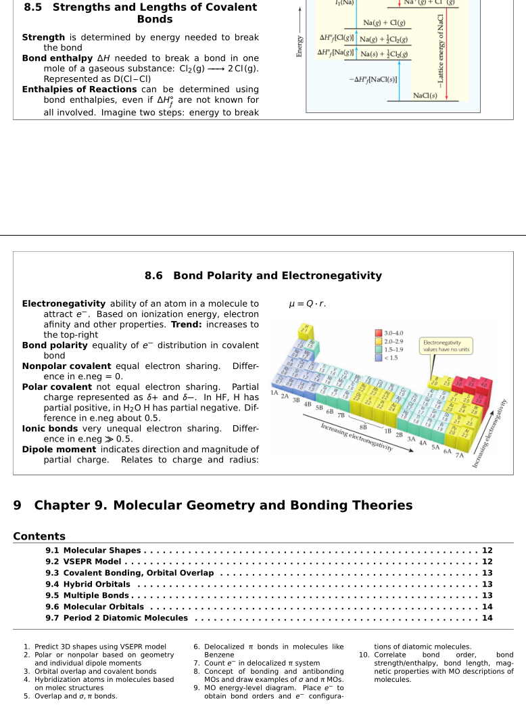

# Personal notes for "Chemistry: The Central Science (13th Edition)"

Notes taken during two introductory chemistry courses (CHEM121 and CHEM122) at
my alma mater, the New Mexico Institute of Mining and Technology, during 2014/2015.
With this goal of creating beautiful and concise notes, I achieved the highest possible
scores in CHEM121's national exam and excellent scores for CHEM122's final exam.

Elegant and compact layout created using LaTeX.

## [Download](./notes.pdf)

## Related Work

[I created an animated periodic table in the style of one of the textbook's images.](https://roguh.com/projects/animated-periodic-table-d3/), see source code at [github.com/roguh/animated-periodic-table-d3](https://github.com/roguh/animated-periodic-table-d3).

See the inspiration in my notes for chapter 8, section 6.

## Credits

Based on Chemistry: The Central Science (13th Edition), 2014
by

- Theodore E. Brown
- H. Eugene LeMay
- Bruce E. Bursten
- Catherine Murphy
- Patrick Woodward
- Matthew E. Stoltzfus

## ISBNs

- ISBN-13: 978-0321910417
- ISBN-10: 0321910419

## License

Images and content intended to be used for educational purposes, "fair use."

CC BY-NC 3.0 US
